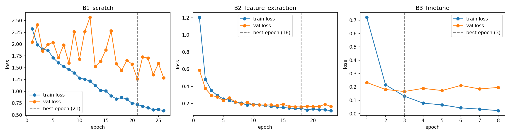

# GSLC_DeepLearning dengan Oxford-IIIT Pet (10 kelas)

Perbandingan model yang dilatih dari nol, feature extraction, dan fine-tuning
untuk klasifikasi gambar dengan data terbatas menggunakan PyTorch dan torchvision.

## Hasil

| Eksperimen | Strategi | Trainable params | Val acc | Macro F1 test |
|---|---|---|---|---|
| B1 | ResNet-18 dari nol | 11.181.642 | 0,587 | 0,550 |
| B2 | ResNet-18 feature extraction | 5.130 | 0,937 | 0,941 |
| B3 | ResNet-18 fine-tuning (layer4 + fc) | 8.398.858 | 0,937 | 0,926 |
| B4 | B3 tanpa augmentasi | 8.398.858 | 0,950 | 0,927 |
| B5 | EfficientNet-B0 feature extraction | 12.810 | 0,973 | 0,970 |

**Temuan utama**
- Fitur pretrained adalah faktor terpenting, karena melatih dengan transfer learning mengungguli pelatihan dari nol sekitar 0,4 F1.
- Pada dataset kecil ini, fine tuning cepat mengalami overfitting dan tidak lebih baik dari feature extraction.
- Augmentasi memperkecil gap train/val tapi tidak mengubah skor akhir.
- EfficientNet-B0 mendapatkan skor terbaik dengan total parameter sekitar 2,8 kali lebih sedikit dari ResNet-18.

## Setup
- Data: Oxford-IIIT Pet, 10 ras (5 kucing, 5 anjing), split stratified 70/15/15
- Model: ResNet-18 dan EfficientNet-B0 dengan bobot ImageNet (torchvision)
- Pelatihan: input 224×224 pixel, batch size 32, AdamW, CrossEntropyLoss,
  early stopping pada validation loss (patience 5, maksimum 30 epoch), seed 42

## Cara menjalankan
1. Buka notebook di Google Colab dan pilih runtime GPU.
2. Jalankan semua cell pada ipynb, nanti dataset akan didownload otomatis. Kemudian log, gambar,
   dan model akan dibuat saat cell terjalankan dan disimpan di `MyDrive/Tugas05` pada Google Drive.

Untuk menjalankan secara lokal gunakan `pip install -r requirements.txt`.
